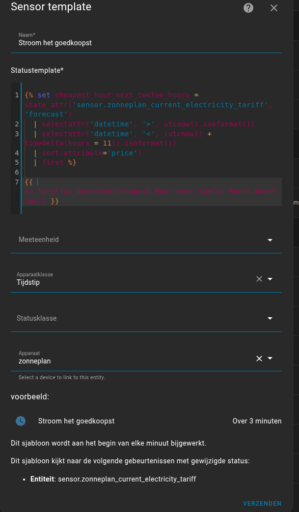
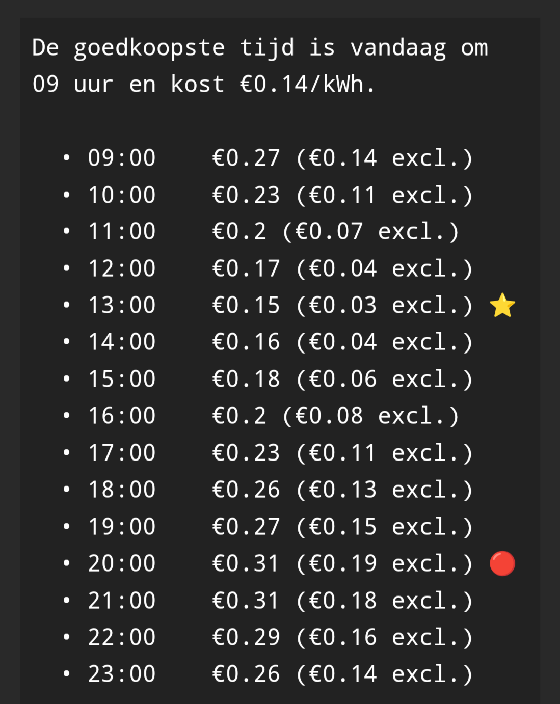
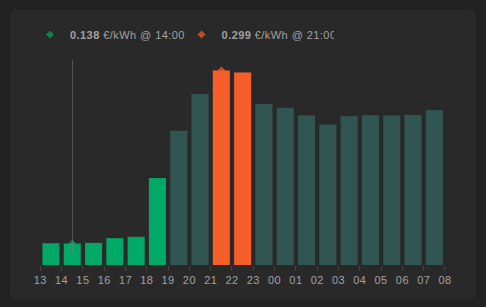

# Zonneplan integration for Home Assistant


[](https://hacs.xyz/)


Unofficial integration for Zonneplan. This integration uses the official Zonneplan API to pull the same data available in the Zonneplan app into your Home Assistant instance.

## Available sensors
### Zonneplan:
   - Solar panels: _(available when you have 1 or more Zonneplan solar inverters)_
     - Yield today: `kWh` (combined yield of all Zonneplan solar inverters) _(can be used as entity on Energy Dashboard)_
   - General energy values: _(available when there is a Zonneplan Connect P1 reader)_
     - Electricity consumption today: `kWh` _(can be used as entity on Energy Dashboard)_
     - Electricity returned today: `kWh` _(can be used as entity on Energy Dashboard)_
     - Gas consumption today: `m³`

### Zonneplan Connect (P1 reader):
<details>
<summary>Sensors available if you have a Zonneplan Connect P1 reader</summary>
   
   - Dsmr version _(default disabled)_
   - Electricity consumption: `W`
   - Electricity production: `W`
   - Electricity average: `W` (average use over the last 5min)
   - Electricity first measured: `date` _(default disabled)_
   - Electricity last measured: `date`
   - Electricity last measured production: `date`
   - Gas first measured: `date` _(default disabled)_
   - Gas last measured: `date`
   - Electricity delivery costs today: `€` _(default disabled)_
   - Electricity delivery costs this month: `€` _(default disabled)_
   - Electricity delivery costs this year: `€` _(default disabled)_
   - Electricity production costs today: `€` _(default disabled)_
   - Electricity production costs this month: `€` _(default disabled)_
   - Electricity production costs this year: `€` _(default disabled)_
   - Gas delivery costs today: `€` _(default disabled)_
</details>

### Zonneplan Energy contract related:
<details>
<summary>Sensors available if you have a Zonneplan energy contract</summary>
   
   - Current Zonneplan Electricity tariff: `€/kWh`
       - The full Electricity forecast is available as a forecast attribute of this sensor
   - Current Zonneplan Gas tariff: `€/m³`
   - Next Zonneplan Gas tariff: `€/m³` 
   - Forecast electricity tariff hour 1-8: `€/kWh` _(default disabled)_
   - Forecast tariff group hour 1-8 _(default disabled)_
   - Current usage: `W`
   - Current usage measured at: `date` _(default disabled)_
   - Current tariff group _(default disabled)_
   - Sustainability score
   - Status message _(default disabled)_
   - Status tip
</details>
     
### Zonneplan Solar inverter:
<details>
<summary>Sensors available if you have a Zonneplan solar inverter</summary>
   
   - Yield total: `kWh`
   - First measured: `date` _(default disabled)_
   - Last measured value: `W`
   - Last measured: `date`
   - Powerplay enabled: `on/off` _(default disabled)_
   - Powerplay/power limit active: `on/off` _(default disabled)_
   - Powerplay total: `€` _(default disabled)_
   - Powerplay today: `€` _(default disabled)_
</details>

### Zonneplan Charge point/Laadpaal:
<details>
<summary>Sensors available if you have a Zonneplan charge point/laadpaal</summary>
   
  - Charge point state
  - Charge point power `W`
  - Charge point energy delivered session `kWh`
  - Charge point next schedule start `date`
  - Charge point next schedule end `date`
  - Charge point dynamic load balancing health _(default disabled)_
  - Charge point connectivity state `on/off`
  - Charge point can charge `on/off`
  - Charge point can schedule `on/off`
  - Charge point charging manually `on/off`
  - Charge point charging automatically `on/off`
  - Charge point plug and charge `on/off`
  - Charge point overload protection active `on/off` _(default disabled)_
  - Charge point session cost `€`
  - Charge point cost total `€`
  - Charge point flex result `€`
  - Charge point session average costs `€/kWh`
  - Charge point start mode _(default disabled)_
  - Charge point dynamic load desired distance `km`
  - Charge point dynamic load desired end time `datetime`
  - Charge point session start time `datetime`
  - Charge point session charged distance `km`
  - Charge point dynamic charging enabled `on/off`
  - Charge point dynamic charging flex enabled `on/off`
  - Charge point dynamic charging flex suppressed `on/off` _(default disabled)_
  - Buttons to start/stop charge
</details>

### Zonneplan Battery:
<details>
<summary>Sensors available if you have a Zonneplan Nexus battery</summary>

  - Average day: `€`
  - Battery cycles
  - Dynamic charging enabled `on/off`
  - Battery state
  - Percentage `%`
  - Power `W` _(default disabled)_
  - Delivery today `kWh`
  - Production today `kWh`
  - Today `€`
  - Total `€`
  - Result this month `€`
  - Result last month `€`
  - Result this year `€`
  - Result last year `€`
  - Net delivery costs this month `€` _(default disabled)_
  - Net delivery costs this year `€` _(default disabled)_
  - Net production costs this month `€` _(default disabled)_
  - Net production costs this year `€` _(default disabled)_
  - Net delivery today `kWh` 
  - Net delivery this month `kWh`
  - Net delivery this year `kWh`
  - Net production today `kWh`
  - Net production this month `kWh`
  - Net production this year `kWh` 
  - Dynamic load balancing overload active `on/off`
  - Dynamic load balancing enabled `on/off`
  - Manual control enabled `on/off`
  - Inverter state _(default disabled)_
  - First measured `datetime` _(default disabled)_
  - Last measured `datetime`
  - Grid congestion active `on/off`
  - Home optimization active `on/off`
  - Home optimization enabled `on/off`
  - Self consumption enabled `on/off`
  - Control mode `home_optimization/dynamic_charging/self_consumption`
  - Select to set control mode
  - Max discharge power (Home optimization) `slider in: W`
  - Max charge power (Home optimization) `slider in: W`

</details>

## Installation

### Install with HACS (recommended)

Ensure you have [HACS](https://hacs.xyz/) installed. 

[](https://my.home-assistant.io/redirect/hacs_repository/?owner=fsaris&repository=home-assistant-zonneplan-one)

1. Click the above My button or search HACS integrations for **Zonneplan**
1. Click `Install`
1. Restart Home Assistant
1. Continue with [setup](#setup)

### Install manually
<details>
   
1. Install this platform by creating a `custom_components` folder in the same folder as your configuration.yaml, if it doesn't already exist.
2. Create another folder `zonneplan_one` in the `custom_components` folder. 
3. Copy all files from `custom_components/zonneplan_one` into the newly created `zonneplan_one` folder.
</details>

### Installing main/beta version using HACS
<details>
   
1. Go to `HACS` => `Integrations`
1. Click on the three dots icon in right bottom of the **Zonneplan** card
1. Click `Reinstall`
1. Make sure `Show beta versions` is checked
1. Select version `main`
1. Click install and restart HA
</details>

## Setup
[](https://my.home-assistant.io/redirect/config_flow_start/?domain=zonneplan_one)
1. Click the above My button _(or navigate to `Configuration` -> `Integrations` -> `+ Add integration` and search for and select `Zonneplan ONE`)_
1. Enter you `emailaddress` you also use in the **Zonneplan** app
1. You will get an email to verify the login.
1. Click "Save"
1. Enjoy

## Setup Energy Dashboard
[](https://my.home-assistant.io/redirect/config_energy/)

#### Solar production
`Zonneplan Yield total` is what your panels produced

#### Grid consumption  
`Zonneplan Electricity consumption today` is what you used from the grid

#### Return to grid
`Zonneplan Electricity returned today` is what you returned to the grid


## Using full forecast in graphs, tables and/or automations

The full forecast is available as attributes of the `Current Zonneplan Electricity tariff` sensor. The incl. tax and excl. tax values are present.
Zonneplan doesn't deliver a constant set of forecast values.

Using a helper you can turn this data into a single "cheapest price at" sensor. Or with some template magic you can turn it in a nice table so shown on your dashboard. Or fill a graph like shown in the official app.

### Cheapest price sensor
<details>
<summary>Setup template sensor helper</summary>

Go to [Helpers](https://my.home-assistant.io/redirect/helpers/) and create and new `Template -> Template sensor` helper to create a sensor that shows the cheapest time based on the forecast data

From [discussions/41](https://github.com/fsaris/home-assistant-zonneplan-one/discussions/41#discussioncomment-4642002)

```


{{ as_local(as_datetime(cheapest_hour_next_twelve_hours.datetime)) }}
```



</details>


### Forecast table
<details>

From [discussions/41](https://github.com/fsaris/home-assistant-zonneplan-one/discussions/41)

```
 {# Verander 2 naar je gewenste offset in uren #}



{% set cheapest_hour_local_time = as_timestamp(strptime(cheapest_hour.datetime, '%Y-%m-%dT%H:%M:%S.%fZ')) + timezone_offset * 3600 %}
De goedkoopste tijd is {{ 'vandaag' if as_timestamp(utcnow())|timestamp_custom('%Y-%m-%d') == cheapest_hour_local_time|timestamp_custom('%Y-%m-%d') else 'morgen' }} om {{ (cheapest_hour_local_time)|timestamp_custom('%H') }} uur en kost €{{"{:.2f}".format(cheapest_hour.electricity_price_excl_tax|float/10000000) }}/kWh.
  
  
  
  
  
  
  
  
  {%- set forecast_local_time = as_timestamp(strptime(forecast.datetime, '%Y-%m-%dT%H:%M:%S.%fZ')) + timezone_offset * 3600 %}
  • {{ (forecast_local_time)|timestamp_custom('%H:%M') }}    €{{ (forecast.electricity_price / 10000000) | round(2) }} (€{{ (forecast.electricity_price_excl_tax / 10000000) | round(2) }} excl.) ⭐🔴
  
```

_Example:_


</details>

### Forecast graph



<details>
<summary>Setup graph card</summary>

From [HomeAssistant community](https://community.home-assistant.io/t/zonneplan-one-custom-component/283435/109)

Install the [PlotlyGraph custom component](https://github.com/dbuezas/lovelace-plotly-graph-card) and setup a card with next config:

```
type: custom:plotly-graph
hours_to_show: 20
refresh_interval: 600
time_offset: 18h
disable_pinch_to_zoom: true
fn: |
  $fn ({ hass, vars, getFromConfig }) => {
    const hours_to_show = getFromConfig('hours_to_show');
    const time_offset = parseInt(getFromConfig('time_offset'));
    vars.x = []; vars.y = []; vars.color = []; vars.hover = []
    vars.min = {p: 999,t: null}; 
    vars.max = {p:-999,t:null};
    vars.ymin = 999; 
    vars.ymax = -999;
    vars.unit_of_measurement = hass.states['sensor.zonneplan_current_electricity_tariff'].attributes.unit_of_measurement
    vars.now = {t: Date.now(), p: parseFloat(hass.states['sensor.zonneplan_current_electricity_tariff'].state)} 
    vars.now.h = "<b>" + vars.now.p.toFixed(3) + "</b> " + vars.unit_of_measurement + " @now " 
    vars.avg = { p: 0, c: 0 }
    let start = new Date();
    start.setHours(start.getHours() - (hours_to_show - time_offset));
    let end = new Date();
    end.setHours(start.getHours() + hours_to_show - 1);
    hass.states['sensor.zonneplan_current_electricity_tariff']?.attributes?.forecast?.map(e => {
      if (start >= new Date(e.datetime) || end <  new Date(e.datetime)) return;
      var t = new Date(e.datetime).getTime()+1800000 
      var p = e.electricity_price/10000000
      vars.avg.p += p
      vars.avg.c++
      var c = e.tariff_group.replace("low", "#00a964").replace("normal", "#365651").replace("high","#ed5e18")
      if (t>=Date.now()-1800000) {
        if (p<vars.min.p) vars.min = {p,t,c}
        if (p>vars.max.p) vars.max = {p,t,c}
      }
      
      if (p<vars.ymin) vars.ymin = p
      if (p>vars.ymax) vars.ymax = p
      vars.x.push(t)
      vars.y.push(p)
      vars.color.push(c)
      vars.hover.push(String(new Date(t).getHours()).padStart(2,"0") + "-" + 
        String(new Date((new Date(t).getTime()+3600000)).getHours()).padStart(2,"0") + ": <b>" + 
        p.toFixed(3) + "</b> " + vars.unit_of_measurement)
    })
    vars.min.h = "<b>" + vars.min.p.toFixed(3) + "</b> " + vars.unit_of_measurement + " @ " + new Date(vars.min.t).getHours() + ":00"
    vars.max.h = "<b>" + vars.max.p.toFixed(3) + "</b> " + vars.unit_of_measurement + " @ " +  new Date(vars.max.t).getHours() + ":00"
    vars.avg.p = vars.avg.p / vars.avg.c
    vars.avg.h = "<b>" + vars.avg.p.toFixed(3) + "</b> " + vars.unit_of_measurement + " average"
    //console.log(vars, hass.states['sensor.zonneplan_current_electricity_tariff']?.attributes?.forecast);
  }
layout:
  margin:
    l: 20
    r: 20
    b: 40
  dragmode: false
  clickmode: none
  legend:
    itemclick: false
    itemdoubleclick: false
  yaxis:
    fixedrange: false
    tickformat: .2f
    range: $fn ({vars}) => [ vars.ymin-0.02, vars.ymax+0.02 ]
    showgrid: false
    visible: false
    showticklabels: true
    showline: false
    title: null
  xaxis:
    tickformat: "%H"
    showgrid: false
    visible: true
    showticklabels: true
    showline: false
    dtick: 3600000
config:
  displayModeBar: false
  scrollZoom: false
  doubleClick: false
entities:
  - entity: ""
    unit_of_measurement: $ex vars.unit_of_measurement
    showlegend: false
    x: $ex vars.x
    "y": $ex vars.y
    marker:
      color: $ex vars.color
    type: bar
    hovertemplate: $ex vars.hover
  - entity: ""
    mode: markers
    textposition: top
    showlegend: true
    name: $ex vars.min.h
    hovertemplate: $ex vars.min.h
    yaxis: y0
    marker:
      symbol: diamond
      color: $ex vars.min.c
      opacity: 0.7
    x:
      - $ex vars.min.t
    "y":
      - $ex vars.min.p
  - entity: ""
    mode: markers
    textposition: top
    showlegend: true
    name: $ex vars.max.h
    hovertemplate: $ex vars.max.h
    yaxis: y0
    marker:
      symbol: diamond
      color: $ex vars.max.c
      opacity: 0.7
    x:
      - $ex vars.max.t
    "y":
      - $ex vars.max.p
  - entity: ""
    name: Now
    hovertemplate: Now
    yaxis: y9
    showlegend: false
    line:
      width: 0.5
      color: gray
      opacity: 1
    x: $ex [vars.now.t, vars.now.t]
    "y":
      - 0
      - 1

```

</details>

## Troubleshooting

If you run into issues during setup or when entries do not update anymore please enable debug logging and provide them when creating an issue.

1. Go to the integration

   [](https://my.home-assistant.io/redirect/integration/?domain=zonneplan_one)
2. Enable debug log by clicking `Enable debug logging`
3. Wait a few minutes for the integration to fetch new data
4. Disable debug logging again (same button as step 2)
5. Log will be presented for download
6. Be sure to remove sensitive data from the log before attaching it to a ticket
